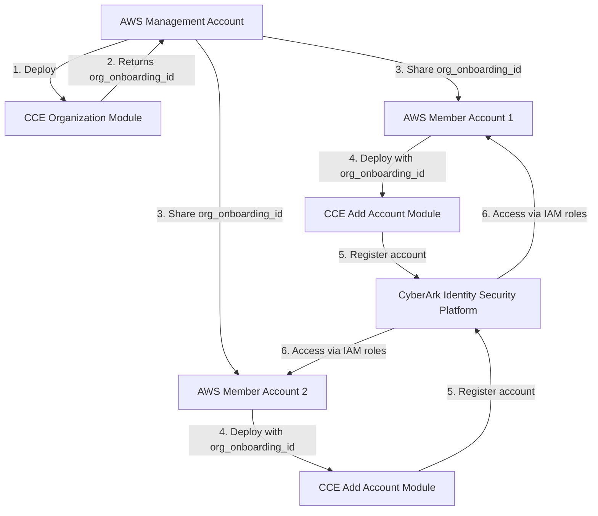

# CyberArk CCE AWS Organization Add Account Module

A Terraform module for onboarding AWS member accounts to CyberArk's Connect Cloud Environments (CCE) SaaS services.

## Overview

This module is designed to be run on **AWS member accounts** after the [CCE organization module](https://github.com/cyberark/terraform-aws-cce-organization) has been deployed on the AWS management account. It automatically provisions the necessary IAM roles and policies for CyberArk SaaS services based on the organization configuration.

The CCE team at CyberArk helps customers easily adopt CyberArk SaaS services and establish secure trust relationships with their AWS environments.

## Architecture



## Features

- **Automatic Service Detection**: Queries the organization configuration to determine which CyberArk services to enable
- **Conditional Resource Provisioning**: Only creates resources for services enabled in the organization
- **Multiple Service Support**: 
  - **SCA (Secure Cloud Access)**: Just-in-time privileged access management with optional SSO integration
  - **SIA (Secure Infrastructure Access)**: EC2 instance discovery and secure access
  - **Secrets Hub**: Centralized AWS Secrets Manager integration
- **Idempotent Operations**: Safe to run multiple times
- **Standardized Outputs**: Provides ARNs and IDs for all created resources

## Prerequisites

Before using this module, ensure you have:

1. **CyberArk Identity Security Platform Account**
   - Active subscription with CCE services enabled
   - API credentials (client ID and secret)
   - Tenant URL

2. **AWS Requirements**
   - An AWS Organization
   - CCE organization module deployed on the management account
   - Organization onboarding ID from the organization module output
   - Appropriate AWS credentials with IAM permissions on the member account

3. **Terraform Requirements**
   - Terraform >= 1.7.5
   - AWS Provider ~> 5.0
   - CyberArk idsec Provider ~> 0.1

## Usage

### Basic Example

```hcl
terraform {
  required_providers {
    aws = {
      source  = "hashicorp/aws"
      version = "~> 5.0"
    }
    idsec = {
      source  = "cyberark/idsec"
      version = "~> 0.1"
    }
  }
}

provider "aws" {
  region = "us-east-1"
}

provider "idsec" {
  # Configure via environment variables:
  # IDSEC_TENANT_URL
  # IDSEC_CLIENT_ID
  # IDSEC_CLIENT_SECRET
}

module "cce_add_account" {
  source = "cyberark/cce-organization-add-account/aws"

  org_onboarding_id = "org-abc123"  # From organization module output
}

output "account_id" {
  value = module.cce_add_account.account_id
}

output "enabled_services" {
  value = module.cce_add_account.enabled_services
}
```

### Environment Variables

Set the following environment variables for CyberArk authentication:

```bash
export IDSEC_TENANT_URL="https://your-tenant.id.cyberark.cloud"
export IDSEC_CLIENT_ID="your-client-id"
export IDSEC_CLIENT_SECRET="your-client-secret"
```

## Examples

A complete working example is available in the [`examples/multiple_services/`](examples/multiple_services/) directory, which demonstrates how to onboard an AWS member account with all CyberArk services that are enabled in your organization configuration.

## Inputs

| Name | Description | Type | Required |
|------|-------------|------|----------|
| `org_onboarding_id` | The organization onboarding ID from the CCE organization module output | `string` | Yes |

## Outputs

| Name | Description |
|------|-------------|
| `account_onboarding_id` | The unique identifier for this account onboarding |
| `deployed_services` | List of CyberArk services deployed for this account |
| `sia_role_arn` | ARN of the SIA role, if enabled (null otherwise) |
| `sca_role_arn` | ARN of the SCA role, if enabled (null otherwise) |
| `secrets_hub_role_arn` | ARN of the Secrets Hub role, if enabled (null otherwise) |

## Service Details

### SCA (Secure Cloud Access)

Provides just-in-time privileged access to cloud resources with:
- Dynamic privilege elevation
- Session monitoring and recording
- Role-based access control
- Optional AWS IAM Identity Center (SSO) integration

**Resources Created:**
- IAM role: `CyberArkRoleSCATerraform-{account-id}`
- IAM policy: `CyberArkPolicyAccountForSCATerraform-{account-id}`
- Conditional SSO policy (if SSO is enabled)

### SIA (Secure Infrastructure Access)

Enables secure access to EC2 instances with:
- Just-in-time access to EC2 instances
- Automated discovery of EC2 resources
- Session recording and monitoring

**Resources Created:**
- IAM role: `CyberArkDynamicPrivilegedAccess-{tenant-id-prefix}`
- IAM policy: `CyberarkJitAccountProvisioningPolicy-{tenant-id-prefix}`

### Secrets Hub

Centralizes management of AWS Secrets Manager secrets:
- Visibility and governance of AWS secrets
- Synchronization with CyberArk Privilege Cloud
- Policy-based access control
- Multi-region support

**Resources Created:**
- IAM role: `CyberArk-Secrets-Hub-AllowSecretsAccessRole-{random-suffix}`
- IAM policy: `CyberArk-Secrets-Hub-AllowSecretsAccessPolicy-{random-suffix}`

## How It Works

1. **Query Organization Data**: The module queries the CCE organization configuration using the provided `org_onboarding_id`
2. **Detect Enabled Services**: Automatically determines which services are enabled in the organization
3. **Provision Resources**: Conditionally creates IAM roles and policies for each enabled service
4. **Register Account**: Registers the account with CyberArk, providing the ARNs of created resources
5. **Output Information**: Returns resource ARNs and configuration details

## Important Notes

- **Service Selection**: You cannot enable/disable individual services at the account level. Services are determined by the organization configuration set on the management account.
- **Management Account**: This module should **NOT** be run on the AWS management account. Use the CCE organization module on the management account instead.
- **Idempotency**: The module is safe to run multiple times and will update resources as needed.
- **Regional Deployment**: Deploy this module in the same region as your primary AWS operations.

## Documentation

For more information:
- [CyberArk Identity Security Platform Documentation](https://docs.cyberark.com/)
- [CyberArk Terraform Provider](https://registry.terraform.io/providers/cyberark/idsec/latest/docs)

## Licensing

This repository is subject to the following licenses:
- **CyberArk Privileged Access Manager**: Licensed under the [CyberArk Software EULA](https://www.cyberark.com/EULA.pdf)
- **Terraform templates**: Licensed under the Apache License, Version 2.0 ([LICENSE](LICENSE))

## Contributing

We welcome contributions! Please see our [Contributing Guidelines](CONTRIBUTING.md) for more details.

## About

CyberArk is a global leader in **Identity Security**, providing powerful solutions for managing privileged access. Learn more at [www.cyberark.com](https://www.cyberark.com).